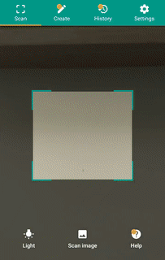
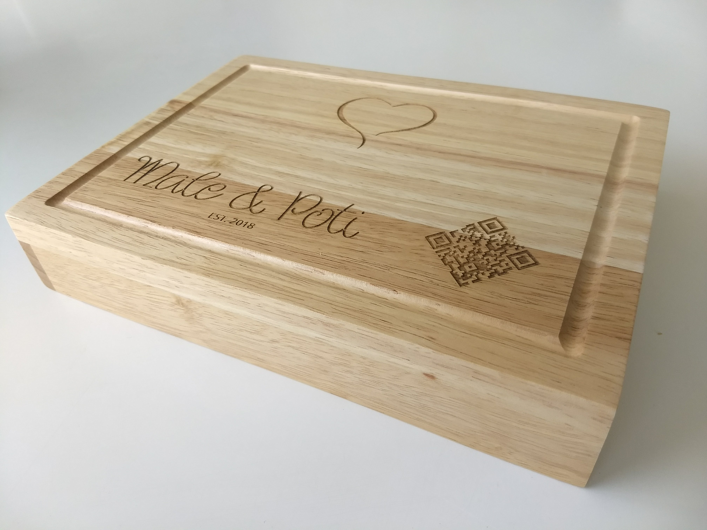
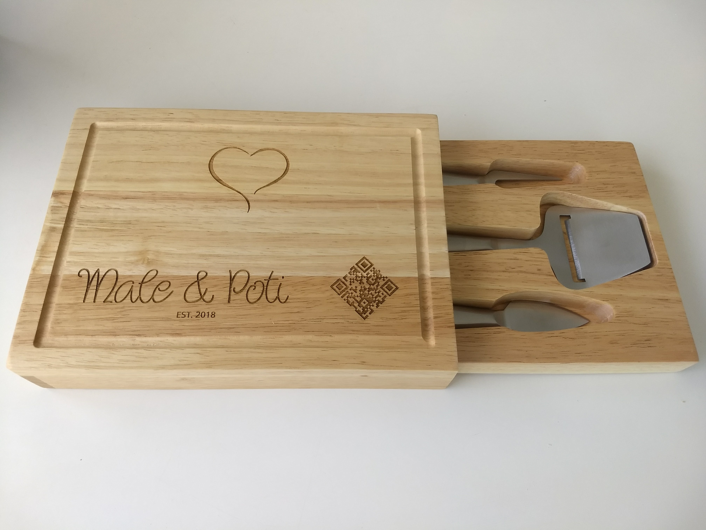

# Recipe Book - A Wedding Gift

***Congratulations on your wedding!***

*Both of you are heading towards a new chapter of your life.
This is surely a blissful moment in your lives;
may life fills you with beautiful surprises.*

#### For my sister

*Dear sister, you make me feel like a proud brother as you take one of the most
important decisions of your life of getting married.
I am sure that you must have chosen the right life partner who would always
keep you happy.
From being a caring sister, I am sure that you are going to be a best wife.*

## Demo

[Click here for the demo](https://jraleman.com/recipe-book/)

## Board

## Acknowledgments

- [Photos](resources/photos-srcs.md)
- [Cheese Set](https://taylorcraftsengraved.com/cheese-sets/square-cheese-set-with-utensils)
- [Quirlycues Font by Qwerks]( http://www.1001fonts.com/quirlycues-font.html)

## License

Recipe Book is licensed under The MIT License (MIT).
Which means that you can use, copy, modify, merge, publish, distribute,
sub-license, and/or sell copies of the final products.
See the [LICENSE](LICENSE/) file for details.
